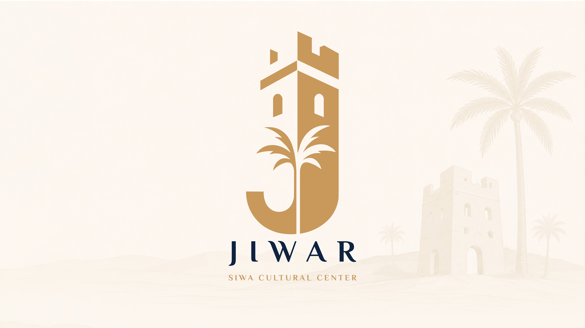

  <!-- حط لينك اللوجو بتاعك هنا مكان الكلمة دي -->
  

  # JIWAR (چوار) — Siwa Cultural Center
  **From Siwa to the world.**

  [Overview](#-project-overview) • [Brand Identity](#-brand-identity) • [Scope](#-project-scope) • [20-Week Timeline](#-project-timeline-20-weeks) • [Team](#-meet-our-team)

   

  
  

 

## 📌 Project Overview
> *"To be Siwa's most welcoming and vibrant cultural space, where everyone can experience the true spirit, art, and warmth of the oasis."*

**Jiwar** is a cultural center project located in Siwa Oasis. We didn't just want to build another tourist spot; we wanted to create a neighborhood. The center includes multiple programs such as an open-air theater, library, traditional workshops, and therapeutic salt springs, creating a unique cultural and experiential destination.

---

## 🎨 Brand Identity
Our visual identity is deeply rooted in the authentic Siwan heritage and traditional Amazigh geometry:
* **The Logo Concept:** A seamless blend of the **Palm Tree** (representing life and nature), the **Letter J** (for Jiwar), and the **Siwan Castle** (representing heritage and protection).
* **Color Palette:** Inspired by the oasis landscape: *Night Sky, Gold Sand, Light Sand, and Salt Lake.*
* **Typography:** El Messiri (Arabic & English) to maintain cultural authenticity.

---

## 🎯 Project Objectives & Scope
* **Revive & Preserve:** Protect Siwan heritage and its authentic local traditions.
* **Visual Identity:** Deliver a comprehensive Brand Guideline including logo lockups, patterns, and merchandise.
* **Digital Presence:** High-Fidelity UI/UX Prototypes for the website and mobile application.
* **Marketing:** Social media campaigns, visitor guides, and billboards.

---

## 📆 Project Timeline (20 Weeks)
*A comprehensive breakdown from initial research to final delivery.*

### Phase 1: Discovery & Research (Weeks 1-4)
* **Week 1:** Project briefing, understanding the core concept, and defining the target audience.
* **Week 2:** Competitor and case study analysis of eco-tourism projects.
* **Week 3:** Gathering initial data about Siwa Oasis, its cultural heritage, and architectural materials.
* **Week 4:** Defining the brand's voice, mission, vision, and core values.

### Phase 2: Strategy & Conceptualization (Weeks 5-8)
* **Week 5:** Creating moodboards to establish the visual tone.
* **Week 6:** Exploring color palettes inspired by Siwa's environment (salt lakes, sand, night sky).
* **Week 7:** Selecting potential typography styles (El Messiri) and defining the brand's tagline: *"From Siwa to the world."*
* **Week 8:** Initial sketching and brainstorming for the logo mark.

### Phase 3: Visual Identity Creation (Weeks 9-12)
* **Week 9:** Translating ideas into digital rough sketches (combining the Palm, Castle, and 'J').
* **Week 10: 🎯 Primary Logo Design Finalized.** Refining the geometry, clear space, and variations.
* **Week 11:** Developing the Amazigh-inspired geometric patterns (triangles, diamonds, sun motifs).
* **Week 12:** Establishing the custom icon set for the center's amenities (Workshops, Salt Lakes, etc.).

### Phase 4: Brand Applications & Merch (Weeks 13-16)
* **Week 13:** Designing stationery, business cards, and visitor ID tags.
* **Week 14:** Developing promotional merchandise (tote bags, hoodies, caps, water bottles).
* **Week 15:** Creating print designs for Visitor Guides, Open Air Theater tickets, and posters.
* **Week 16:** Designing physical and digital billboards (Out-of-home advertising).

### Phase 5: Digital Experience & Final Delivery (Weeks 17-20)
* **Week 17:** Social media strategy and designing campaign posts (e.g., "Step Outside", "Cultural Nights").
* **Week 18:** UI/UX wireframing for the Jiwar dedicated website and mobile app.
* **Week 19:** High-fidelity UI/UX prototyping and final usability reviews.
* **Week 20:** Compiling the final **Jiwar Brand Guideline Book**, project documentation, and final handover.

---

## 👥 Meet Our Team
| Name | Role |
| :--- | :--- |
| **Ahmed Wageeh** | Team Leader |
| **Youssef Mohamed** | Designer |
| **Tony Samir** | Designer |
| **Sally Kassem** | Designer |
